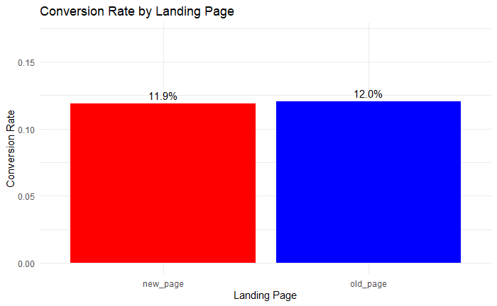
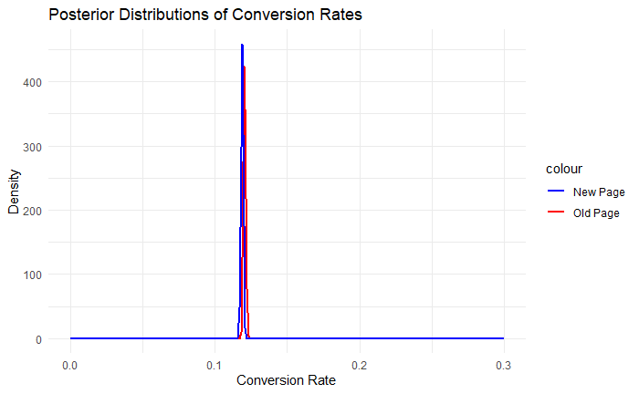

```{r setup, include=FALSE}
knitr::opts_chunk$set(echo = FALSE, message = FALSE, warning = FALSE, fig.width=6, fig.height=4, fig.align='center')
```

```{r}
library(knitr)
```

This study is for a Hospital that launched a new website and also that interested in finding the behavior and Length of the stay of patients. There were two data sets which was obtained as ab_test and mimic data sets for each of the objectives separately. 

# Hospital New Website (A/B testing)

## 1. Objective of Data Analysis

Based on the dataset and the topic at hand, this data analysis aims to evaluate the performance of a new webpage design in terms of conversion rates using the dataset "ab_test.csv".

### Goals
Explore and Visualize Data Clean and preliminarily explore the collected data to
understand the user access and basic conversion rates of both the new and old
webpages. 

### Conduct A/B Testing Using Bayesian Methods
Unlike traditional A/B testing that relies on p-values, this analysis employs Bayesian methods. Specifically, a prior distribution (Beta distribution) is defined for the old conversion rate based on past observations. For the new conversion rate, a non-informative prior distribution is set. Using the gathered data, these prior
distributions are updated to derive their respective posterior distributions.

### Carry out Progressive Inference
Initially, only 100 data points are used to update the prior and make inferences, especially estimating the probability of the new page having a higher conversion rate. Subsequently, an additional 100 data points are added each time to update the
posterior and re-infer. This process aids in understanding how the influence of the
prior diminishes as more data is collected. That is, determining at what data volume
the observed data becomes significant enough that the prior's impact on the
conclusion becomes negligible. 

### Data Overview
Data Source: ab_data.csv Variable Explanations: user_id: User ID timestamp: Visit
Time group: The group the user belongs to (Control group, Experimental group)
landing_page: Type of page the user visited (New, Old) converted: Whether the
conversion action was completed (0 for No, 1 for Yes

## 2. Data Preprocessing

### Data Cleaning
Exclusion of illogical data combinations: To ensure data accuracy, the first step is to
remove illogical data combinations. Through analysis using the R software, we
identified instances in the dataset that did not meet the experimental criteria: some in the control group saw the new page, while some in the experimental group viewed the old page. Such illogical combinations might lead to a misinterpretation of the experiment's effects. Therefore, for analysis accuracy, these records must be removed. The numbers of such records are 1928 and 1965 respectively. The original dataset contained 294,478 records; after removal, the effective data count stood at 290,585.

### Handling Data Completeness and Duplicates
Data completeness is a strength of this analysis. Upon examination using R, we found
no missing values in the dataset, ensuring that no potential information was lost. Additionally, when reviewing duplicates, we believed that these might represent
multiple visits by the same user. This is an important factor we intended to observe
and consider. Thus, after thorough analysis, we decided to retain these duplicate
values, considering them to be of practical significance and value in this dataset.

### Conclusion: 
Following the above data cleaning process, we now have a clean, complete, and logically consistent dataset, laying a solid foundation for further
in-depth analysis and modeling. 

## 3. Preliminary Analysis and Visualization
Initial Data Analysis: Data Overview: user_id: The unique identifier for users ranges
from 630,000 to 945,999, representing visits from multiple users. timestamp: The
timespan of data collection ranges from January 2, 2017, 13:42:05 to January 24, 2017, 13:41:54. This provides us with nearly a month's worth of user access and
conversion data. group: Users are divided into two groups: control and treatment. Users in the control group see the old page, while those in the treatment group see the
new page. landing_page: This column corresponds to the group the users belong to. The control group should only see the old_page, and the treatment group should only
see the new_page. As demonstrated in the data cleaning section, illogical
combinations have already been removed. converted: Indicates whether a user
completed a conversion (e.g., registration or purchase). From the data, we can observe
that the average conversion rate is approximately 11.96%. 

## 4. Conversion Rate Analysis

```{r, out.width='70%', fig.align='center'}

```

From the bar chart titled "Conversion Rate by Landing Page", we can infer that the
conversion rates for both the new and old pages are quite close. Specifically: New
page: Conversion rate is 11.9% Old page: Conversion rate is 12.0% Such a slight
difference might not be significant in practical applications, but further statistical
testing is required to ascertain this

### Conclusion
In the preliminary data analysis, we observed that the conversion rates for both the
new and old pages are very similar. Even though the design of the new page might be
appealing, there isn't a noticeable increase in conversion rate from what we observed. To determine any significant differences between the two pages, we would need to
conduct more detailed statistical analyses or A/B testing.

## 5. Bayesian A/B Testing Analysis

Introduction to Posterior Distribution: Bayesian analysis offers a method to estimate
differences in conversion rates by integrating prior knowledge (i.e., the prior
distribution) with observed data to form a posterior distribution. This posterior
distribution represents our most recent estimate of the conversion rate based on the
observed data.

### Analysis Results

```{r, out.width='70%', fig.align='center'}

```

Shape of the Posterior Distribution: From the chart, it's evident that the posterior
distribution of conversion rates for both the new and old pages is peaked and very
close to one another. This implies that our estimate for the conversion rate is quite
certain.

### Difference in Conversion Rates
The peak values of the posterior distributions for the conversion rates of the new and
old pages are very close, both centering around 0.1. While the new page has a slightly
lower conversion rate than the old one, the difference is minimal. \ 
Overlap Area: The chart reveals a significant overlap area between the two posterior
distributions, suggesting that the conversion rates for the new and old pages might be
very similar.

### Conclusion
Based on the posterior distribution analysis from the Bayesian A/B test, the
conversion rates for the new and old pages appear to be very alike. This emphasizes
the findings from the earlier conversion rate analysis, indicating that the new page
didn't bring about a noticeable improvement in terms of conversion rate. \ 
While the design of the new page might have other factors that appeal to users, from a
conversion rate perspective, we didn't observe a significant advantage. To decide
whether to adopt the new page, we might need to consider other metrics or conduct a
more in-depth analysis.

## 6. Progressive Bayesian Analysis

Analysis Objective: The aim of progressive Bayesian analysis is to observe the
changes in the posterior distribution by incrementally increasing the number of
observed data. This method helps us understand the amount of data required to have a
stable and reliable effect on the posterior distribution, thereby clarifying how much
data we need when the impact of the prior distribution becomes negligible.
### Method Explanation
Choice of Prior Distribution: Different prior distributions were initialized for the old
and new pages.

### Selection of Data Subset
From the complete dataset, the volume of data is progressively increased for
analysis. Updating of the Posterior Distribution: Based on each data subset, calculate and
update the posterior distribution. 

### Computation of Posterior Probabilities
For each data subset, compute the probability that the conversion rate of the new page
exceeds that of the old page. 

### Evaluation of the Influence of Prior Distribution
Determine when the influence of the prior distribution becomes insignificant by
observing the difference between consecutive posterior probabilities. 

### Results
Through progressive analysis, we found that when the observed data volume reaches
1800, the influence of the prior distribution no longer becomes significant. This
implies that to obtain a posterior distribution that's nearly unaffected by the prior
distribution, we require at least 1800 data points.

### Conclusion
Progressive Bayesian analysis provides a valuable method to assess the influence of
the amount of data on the posterior distribution. In this context, the influence of the
prior distribution is essentially eliminated when the data volume is at 1800. This
signifies that ensuring an ample amount of data is crucial when conducting Bayesian
analysis, especially when we're less confident about our choice of prior distribution.

## 7. Conclusion:

### Statistical Descriptive Analysis
The data description provides us with a basic overview of the conversion rate. The
conversion rate of the new page and the old page shows a slight difference.

### Logistic Regression Analysis
Through logistic regression, we found that there is a statistically significant difference
in conversion rates between the new page and the old page. However, further
evaluation is needed to determine if this difference has practical significance.

### Frequentist A/B Testing
The p-value calculation shows that the conversion rate of the new page is not
significantly higher than that of the old page, which is consistent with our logistic
regression analysis results. 

### Bayesian A/B Testing Analysis
The posterior distribution shows that although the conversion rate of the new page is
slightly higher, the difference between the two is very close, almost overlapping. Sequential Bayesian Analysis: We found that at least 1800 data points are needed to
reduce the influence of the prior distribution, making it no longer significant.

### Suggestions
New Page Effect Evaluation: Even though the conversion rate of the new page is
slightly higher than that of the old page, the difference is not significant. Before
considering promoting the new page as the default page, it is recommended to
conduct a more in-depth user experience survey and evaluation to determine the other
potential values of the new page


# Predictive analysis on the Length of the Stay of Patients in the Hospital

```{r}
library(here)
library(tidyverse)
library(psych)
library(GGally)
library(ggcorrplot)
library(ggmosaic)
library(ggrepel)
library(MASS)
library(nnet)
library(car)
library(ggpubr)
library(patchwork)
```

## 1. Intro

The MIMIC (Medical Information Mart for Intensive Care) data set is a large, publicly available dataset developed by the MIT Lab for Computational Physiology. It contains de-identified health data associated with ~40,000 critical care patients, including demographics, vital signs, laboratory tests, and more.

## 2. Objective

The main objective of this analysis is to identify the behavior of the Length of the stay of the patients and predict the stay using the given data. 

## 3. The Dataset

As mentioned before the dataset is consisted of 27 variables with the response variables. The response variable of Length of stay "LOS days" and there was another variable whether if was categorised. 
The predictor variables were consisted of data related to gender, age, Type of admission, where the patient was admitted from, Insurance type, Religion and ehnicity, marital status along with details about number of callouts made, diagnosis made, procedures, prescriptions,etc.

```{r}

DF <- read.csv(here("train_data.csv"))

for (i in c( 2, 5, 6, 8:11, 26,28)) {
  
  DF[[i]] <- as.factor(DF[[i]])
  
}

DF_1 <- DF[,-c(7, 15)]


```

## 4. Length of Stay and Composition of Data. 

The no of days a patient stay in a hospital has skewed more towards right, which explained than majority of the patients stays less than 25 days in a hospital but still there are patients who stays more than 250 days.Therefore in order to simplify the analysis and represenation process the length of the stay was categorsied to 4 groups where patients stay between 0 to less than 4 days then its in group 0, 4 to less than 8 days in group 1, 8 to less than 12 days in group 2 and more than 12 days in group 3. It can identified from the below graph that the distribution in each of the category is different to each other.

```{r}

ggplot(DF_1, aes(LOSdays)) + geom_density(aes(color = LOSgroupNum)) +
facet_wrap(~ LOSgroupNum, scales = "free") + theme_minimal() + theme(plot.title = element_text(size = 10),legend.title = element_text(size = 7), axis.title.x = element_text(size = 7),  axis.title.y = element_text(size = 7), legend.text = element_text(size = 7) )+ ggtitle("Distribution of Length of stay in days of patients according the the group")

```

Then it was identified that Age of the patient, Admit type and location, Insurance, Marital status and religion along with the details about number of call-outs made, diagnosis made, procedures, prescriptions,etc. has an effect to the length of the stay of the patient. 
The below graph shows the evidence that most of the patients stay after 4 days are more than 50 years of age. It is obvious that new born babies stay at least 4 days in a hospital.

```{r}
ggplot(DF_1, aes(age)) + geom_density(aes(color = LOSgroupNum)) +
facet_wrap(~ LOSgroupNum, scales = "free") + theme_minimal() + theme(plot.title = element_text(size = 10),legend.title = element_text(size = 7), axis.title.x = element_text(size = 7),  axis.title.y = element_text(size = 7), legend.text = element_text(size = 7) )+ ggtitle("Distribution of Age of patients according the the Length of Stay")
```

When a patient stays in a hospital there are many diagnosis test, labs reports, prescriptions, procedures longer they stay. Therefore it was identified when the number of chart events like vital sign measurements are increasing then the Total number of interactions also increases which has a strong connection. Other than that it was also observed that when the number of transfers of a patient increases then the number of diagnosis test as well as the number of notes also increases or vice-versa, which shows a strong bond between those measures. Therefore when building a model some those variables were not considered since there are other variables which represent those. These relationships can be identified from below heat map.

```{r}

ggcorrplot(cor(DF_1[,c(12,15,18,22,23,25)]),
           lab = TRUE,
           type = "lower") +  theme(plot.title = element_text(size = 10),legend.title = element_text(size = 7), axis.text.x  = element_text(size = 7),  axis.text.y = element_text(size = 7), legend.text = element_text(size = 7) )+ ggtitle("Correlation Coeffients")

```

However, There wasn't any strong linear relationship between the Length of the stay and the number of the notes, transfers, diagnosis test, etc. And also the distribution of the Length of the stay is not quite identifiable, therefore for the further analysis of the response variables "Length of the stay" , the categorized variable of it was used. Then it was identified that there is an significant relationship between the number of the notes, transfers, diagnosis test, etc. and the Length of the stay grouped variable.\
It can be identified that number of diagnosis gets higher sometimes in patients stayed less than 4 days in the hospital where as the maximum number of diagnosis per day in for the patients stayed more than 12 days is less than 3.5. Therefore it can be concluded that when a patients stays less than 4 days then there is a tendency that more than 100 diagnosis tests will be done in a day.

```{r}
ggplot(DF_1, aes(NumDiagnosis) )+ geom_density(aes(color = LOSgroupNum)) +
  facet_wrap(~ LOSgroupNum, scales = "free") + theme_minimal() + theme(plot.title = element_text(size = 10),legend.title = element_text(size = 7), axis.title.x = element_text(size = 7),  axis.title.y = element_text(size = 7), legend.text = element_text(size = 7) )+ 
    labs(title = "Distribution of Number of Diagnosis per day with the Length of the stay")

```

Other than the number of diagnosis per day, the distribution of the number of procedures, lab reports, transfers, notes, etc. per day follows a more or less same distribution where as the numbers per day tends to be higher in stay of less than 4 days.

## 5. Likelihood Function

All the predictor variables other than the gender, ethnicity and the total number of interactions during a patients day were used in the likelihood function. Then step analysis was done to find the variables that describe the length of the stay most then it was found that all the other variables than the ones mentioned before describe it well with an AIC value of 25000. In order find the distribution of these variables they were categorized based on its distribution using suitable bins which were different to each variable. Therefore all the predictor variables were converted to categorical variables. The likelihood function can be shown as below.

Using Naïve Bayes Classifier the likelihood function for the predictive variables given $\theta$ is given by:

$$
L( X | \theta_j) = \prod_{i=1}^{17} P(X_i | \theta = \theta_j)
$$

where:\
- $L( X | \theta_j)$ is the likelihood of $X$ (Data) given at a level of response variable $\theta_j$,\
- $P(X_i | \theta = \theta_j)$ is the probability of observing the predictor variable $X$ at level $\theta_j$ ,\

Therefore the probability of distribution of each predictor variable (multinomial) at each level of the response variable was obtained using the proportions in the training dataset. 

```{r}


DF_1$age_bin <- cut(DF_1$age, breaks = c(0,10,20,30,40,50,60,70,80,Inf), 
                    labels = c("0 - 10", "11 - 20", "21 - 30", "31 - 40", "41 - 50",
                               "51 - 60", "61 - 70", "71 - 80", "80+"),
                    include.lowest = TRUE)

DF_1$NumCallouts_Bin <- cut(DF_1$NumCallouts, breaks = c(0, 0.1, 0.2, 0.3, 0.4, 0.5, 0.6, 0.7, 0.8, Inf), 
                            labels = c("0 - 0.1", "0.1 - 0.2", "0.2 - 0.3","0.3 - 0.4","0.4 - 0.5",
                                       "0.5 - 0.6","0.6 - 0.7", "0.7 - 0.8","0.8 +"),
                            include.lowest = TRUE)

DF_1$NumDiagnosis_Bin <- cut(DF_1$NumDiagnosis, breaks = c(0, 0.5, 1.0, 1.5, 2.0, 2.5, 3.0, 3.5, 4.0,4.5, 5.0,5.5,6.0,6.5,7.0, 7.5, Inf), 
                            labels = c("0.0 - 0.5", "0.5 - 1.0", "1.0 - 1.5","1.5 - 2.0","2.0 - 2.5",
                                       "2.5 - 3.0","3.0 - 3.5", "3.5 - 4.0","4.0 - 4.5",
                                       "4.5 - 5.0","5.0 - 5.5", "5.5 - 6.0",
                                       "6.0 - 6.5", "6.5 - 7.0", "7.0 - 7.5", "7.5+"),
                            include.lowest = TRUE)

DF_1$NumProcs_Bin <- cut(DF_1$NumProcs, breaks = c(0, 0.50, 1.00, 1.50, 2.00
                                                   , 2.50, 3.00,3.50, 4.00, 4.50,
                                                   5.00,Inf), 
                            labels = c("0 - 0.50", "0.50 - 1.00", 
                                       "1.00 - 1.50","1.50 - 2.00","2.00 - 2.50",
                                       "2.50 - 3.00","3.00 - 3.50","3.50 - 4.00", "4.00 - 4.50",
                            "4.50 - 5.00","5.00+"),
                            include.lowest = TRUE)

DF_1$NumCPTevents_Bin <- cut(DF_1$NumCPTevents, breaks = c(0, 1, 2, 3, 4, 5, 6, 7, Inf), 
                            labels = c("0 - 1", "1 - 2", "2 - 3","3 - 4",
                            "4 - 5", "5 - 6","6 - 7", "7+"),
                            include.lowest = TRUE)

DF_1$NumInput_Bin <- cut(DF_1$NumInput, breaks = c(0, 50, 100, 150, 200, 250, 300, 350, 400,
                                                  450, 500, 550, 600, 700, Inf), 
                            labels = c("0 - 50", "50 - 100", "100 - 150","150 - 200","200 - 250",
                            "250 - 300","300 - 350", "350 - 400","400 - 450",
                            "450 - 500","500 - 550", "550 - 600","600 - 700",
                          "700+"),
                            include.lowest = TRUE)

DF_1$NumLabs_Bin <- cut(DF_1$NumLabs, breaks = c(0, 20, 40, 60, 80, 100, 120, 140, 160,
                                                  180, 200, 300, Inf), 
                            labels = c("0 - 20", "20 - 40", "40 - 60","60 - 80","80 - 100",
                            "100 - 120","120 - 140", "140 - 160","160 - 180","180 - 200","200 - 300", "300+"),
                            include.lowest = TRUE)

DF_1$NumMicroLabs_Bin <- cut(DF_1$NumMicroLabs, breaks = c(0, 0.5, 1.0, 1.5, 2.0, 2.5, 3.0, 3.5,
                                                           4.0, 4.5, 5.0, 10.0, 20.0, 30.0, Inf), 
                            labels = c("0 - 0.5", "0.5 - 1.0", "1.0 - 1.5","1.5 - 2.0","2.0- 2.5",
                                       "2.5 - 3.0","3.0 - 3.5", "3.5 - 4.0","4.0 - 4.5",
                                       "4.5 - 5.0","5.0 - 10.0", "10.0 - 20.0",
                                       "20.0 - 30.0", "30.0+"),
                            include.lowest = TRUE)

DF_1$NumNotes_Bin <- cut(DF_1$NumNotes, breaks = c(0, 0.25, 0.50, 0.75, 1.00,
                                                   1.5, 2.0, 3.0, 6.0, Inf), 
                            labels = c("0 - 0.25", "0.25 - 0.50", "0.50 - 0.75","0.75 - 1.00",
                            "1.00 - 1.50", "1.50 - 2.00","2.00 - 3.00", "3.00 - 6.00",
                            "6.00+"),
                            include.lowest = TRUE)

DF_1$NumOutput_Bin <- cut(DF_1$NumOutput, breaks = c(0, 2, 4, 6, 8, 10, 12, 14, 16,
                                                  18, 20, 40, 60, 80, Inf), 
                            labels = c("0 - 2", "2 - 4", "4 - 6","6 - 8","8 - 10",
                            "10 - 12","12 - 14", "14 - 16","16 - 18","18 - 20","20  - 40", "40 - 60", "60 - 80", "80+"),
                            include.lowest = TRUE)

DF_1$NumRx_Bin <- cut(DF_1$NumRx, breaks = c(0, 2, 4, 6, 8, 10, 12, 14, 16,
                                             18, 20,30, 40, 50,  Inf), 
                            labels = c("0 - 2", "2 - 4", "4 - 6","6 - 8","8 - 10",
                            "10 - 12","12 - 14", "14 - 16","16 - 18","18 - 20","20 - 30", "30 - 40", "40 - 50", "50+"),
                            include.lowest = TRUE)

DF_1$NumProcEvents_Bin <- cut(DF_1$NumProcEvents,breaks = c(0, 0.5, 1.0, 1.5, 2.0, 2.5, 3.0, 3.5,
                                                           4.0, 4.5, 5.0,8.0, Inf), 
                            labels = c("0 - 0.5", "0.5 - 1.0", "1.0 - 1.5","1.5 - 2.0","2.0- 2.5",
                                       "2.5 - 3.0","3.0 - 3.5", "3.5 - 4.0","4.0 - 4.5",
                                       "4.5 - 5.0","5.0 - 8.0","8.0+"),
                            include.lowest = TRUE)

DF_1$NumTransfers_Bin <- cut(DF_1$NumTransfers, breaks = c(0, 0.25, 0.50, 0.75, 1.00, 1.25, 1.50, 1.75,2.00,2.25,
                                        2.50, Inf), 
                            labels = c("0 - 0.25", "0.25 - 0.50", "0.50 - 0.75","0.75 - 1.00",
                            "1.00 - 1.25", "1.25 - 1.50","1.50 - 1.75", "1.75 - 2.00",
                            "2.00 - 2.25","2.25 - 2.50","2.50+"),
                            include.lowest = TRUE)

DF_1$NumChartEvents_Bin <- cut(DF_1$NumChartEvents, breaks = c(0, 200, 400, 600, 800, 1000, 1200,
                                                               1400, 1600,1800, 2000,5000, 10000, 20000, 30000, Inf), 
                            labels = c("0 - 200", "200 - 400", "400 - 600","600 - 800",
                                       "800 - 1000","1000 - 1200","1200 - 1400", "1400 - 1600",
                                       "1600 - 1800","1800 - 2000","2000 - 5000",
                                       "5000 - 1000","1000 - 20000","20000 - 30000", "30000+"),
                            include.lowest = TRUE)

DF_1$TotalNumInteract_Bin <- cut(DF_1$TotalNumInteract, breaks = c(0, 200, 400, 600,
                                                                   800, 1000, 1200,
                                                                   1400, 1600,1800,
                                                                   2000, Inf), 
                            labels = c("0 - 200", "200 - 400", "400 - 600","600 - 800",
                                       "800 - 1000","1000 - 1200","1200 - 1400", 
                                       "1400 - 1600", "1600 - 1800","1800 - 2000",
                                       "2000+"),
                            include.lowest = TRUE)

```

```{r}
DF_2 <- DF_1[,c(5:9,24,26:41)]
```

```{r}

attach(DF_2)

Age <- table(LOSgroupNum, age_bin) %>% prop.table(margin = 1)
Admit_type <- table(LOSgroupNum, admit_type) %>% prop.table(margin = 1)
Admit_location <- table(LOSgroupNum, admit_location) %>% prop.table(margin = 1)
Insurance <- table(LOSgroupNum, insurance) %>% prop.table(margin = 1)
Religion <- table(LOSgroupNum, religion) %>% prop.table(margin = 1)
Marital_Status <- table(LOSgroupNum, marital_status) %>% prop.table(margin = 1)
Expired_Hospitals <- table(LOSgroupNum, ExpiredHospital) %>% prop.table(margin = 1)
NumCallouts <- table(LOSgroupNum, NumCallouts_Bin) %>% prop.table(margin = 1)
NumDiagnosis <- table(LOSgroupNum, NumDiagnosis_Bin) %>% prop.table(margin = 1)
NumProcs <- table(LOSgroupNum, NumProcs_Bin) %>% prop.table(margin = 1)
NumCPTevents <- table(LOSgroupNum, NumCPTevents_Bin) %>% prop.table(margin = 1)
NumInput <- table(LOSgroupNum, NumInput_Bin) %>% prop.table(margin = 1)
NumLabs <- table(LOSgroupNum, NumLabs_Bin) %>% prop.table(margin = 1)
NumMicroLabs <- table(LOSgroupNum, NumMicroLabs_Bin) %>% prop.table(margin = 1)
NumNotes <- table(LOSgroupNum, NumNotes_Bin) %>% prop.table(margin = 1)
NumOutput <- table(LOSgroupNum, NumOutput_Bin) %>% prop.table(margin = 1)
NumRx <- table(LOSgroupNum, NumRx_Bin) %>% prop.table(margin = 1)
NumProcEvents <- table(LOSgroupNum, NumProcEvents_Bin) %>% prop.table(margin = 1)
NumTransfers <- table(LOSgroupNum, NumTransfers_Bin) %>% prop.table(margin = 1)
NumChartEvents <- table(LOSgroupNum, NumChartEvents_Bin) %>% prop.table(margin = 1)
TotalNumInteract <- table(LOSgroupNum, TotalNumInteract_Bin) %>% prop.table(margin = 1)

```

```{r}
LOSGroup <- table(LOSgroupNum) %>% prop.table()

detach(DF_2)
```

```{r}

Test <- read.csv(here("test_data(hospital).csv"))

for (i in c( 2, 5, 6, 8:11, 26,28)) {
  
  Test[[i]] <- as.factor(Test[[i]])
  
}


Test_1 <- Test[,-c(7, 15)]

Test_1$age_bin <- cut(Test_1$age, breaks = c(0,10,20,30,40,50,60,70,80,Inf), labels = c("0 - 10", 
                "11 - 20", "21 - 30", "31 - 40", "41 - 50", "51 - 60", "61 - 70", "71 - 80",
                "80+"), include.lowest = TRUE)

Test_1$NumCallouts_Bin <- cut(Test_1$NumCallouts, breaks = c(0, 0.1, 0.2, 0.3, 0.4, 0.5, 0.6, 0.7, 0.8, Inf), 
                            labels = c("0 - 0.1", "0.1 - 0.2", "0.2 - 0.3","0.3 - 0.4","0.4 - 0.5",
                                       "0.5 - 0.6","0.6 - 0.7", "0.7 - 0.8","0.8 +"),
                            include.lowest = TRUE)

Test_1$NumDiagnosis_Bin <- cut(Test_1$NumDiagnosis, breaks = c(0, 0.5, 1.0, 1.5, 2.0, 2.5, 3.0, 3.5, 4.0,4.5, 5.0,5.5,6.0,6.5,7.0, 7.5, Inf), 
                            labels = c("0 - 0.5", "0.5 - 1.0", "1.0 - 1.5","1.5 - 2.0","2.0- 2.5",
                                       "2.5 - 3.0","3.0 - 3.5", "3.5 - 4.0","4.0 - 4.5",
                                       "4.5 - 5.0","5.0 - 5.5", "5.5 - 6.0",
                                       "6.0 - 6.5", "6.5 - 7.0", "7.0 - 7.5", "7.5+"),
                            include.lowest = TRUE)

Test_1$NumProcs_Bin <- cut(Test_1$NumProcs, breaks = c(0, 0.50, 1.00, 1.50, 2.00
                                                   , 2.50, 3.00,3.50, 4.00, 4.50,
                                                   5.00,Inf), 
                            labels = c("0 - 0.50", "0.50 - 1.00", 
                                       "1.00 - 1.50","1.50 - 2.00","2.00 - 2.50",
                                       "2.50 - 3.00","3.00 - 3.50","3.50 - 4.00", "4.00 - 4.50",
                            "4.50 - 5.00","5.00+"),
                            include.lowest = TRUE)

Test_1$NumCPTevents_Bin <- cut(Test_1$NumCPTevents, breaks = c(0, 1, 2, 3, 4, 5, 6, 7, Inf), 
                            labels = c("0 - 1", "1 - 2", "2 - 3","3 - 4",
                            "4 - 5", "5 - 6","6 - 7", "7+"),
                            include.lowest = TRUE)

Test_1$NumInput_Bin <- cut(Test_1$NumInput,breaks = c(0, 50, 100, 150, 200, 250, 300, 350, 400,
                                                  450, 500, 550, 600, 700, Inf), 
                            labels = c("0 - 50", "50 - 100", "100 - 150","150 - 200","200 - 250",
                            "250 - 300","300 - 350", "350 - 400","400 - 450",
                            "450 - 500","500 - 550", "550 - 600","600 - 700",
                          "700+"),
                            include.lowest = TRUE)

Test_1$NumLabs_Bin <- cut(Test_1$NumLabs, breaks = c(0, 20, 40, 60, 80, 100, 120, 140, 160,
                                                  180, 200, 300, Inf), 
                            labels = c("0 - 20", "20 - 40", "40 - 60","60 - 80","80 - 100",
                            "100 - 120","120 - 140", "140 - 160","160 - 180","180 - 200","200 - 300", "300+"),
                            include.lowest = TRUE)

Test_1$NumMicroLabs_Bin <- cut(Test_1$NumMicroLabs, breaks = c(0, 0.5, 1.0, 1.5, 2.0, 2.5, 3.0, 3.5,
                                                           4.0, 4.5, 5.0, 10.0, 20.0, 30.0, Inf), 
                            labels = c("0 - 0.5", "0.5 - 1.0", "1.0 - 1.5","1.5 - 2.0","2.0- 2.5",
                                       "2.5 - 3.0","3.0 - 3.5", "3.5 - 4.0","4.0 - 4.5",
                                       "4.5 - 5.0","5.0 - 10.0", "10.0 - 20.0",
                                       "20.0 - 30.0", "30.0+"),
                            include.lowest = TRUE)

Test_1$NumNotes_Bin <- cut(Test_1$NumNotes,breaks = c(0, 0.25, 0.50, 0.75, 1.00,
                                                   1.5, 2.0, 3.0, 6.0, Inf), 
                            labels = c("0 - 0.25", "0.25 - 0.50", "0.50 - 0.75","0.75 - 1.00",
                            "1.00 - 1.50", "1.50 - 2.00","2.00 - 3.00", "3.00 - 6.00",
                            "6.00+"),
                            include.lowest = TRUE)

Test_1$NumOutput_Bin <- cut(Test_1$NumOutput, breaks = c(0, 2, 4, 6, 8, 10, 12, 14, 16,
                                                  18, 20, 40, 60, 80, Inf), 
                            labels = c("0 - 2", "2 - 4", "4 - 6","6 - 8","8 - 10",
                            "10 - 12","12 - 14", "14 - 16","16 - 18","18 - 20","20  - 40", "40 - 60", "60 - 80", "80+"),
                            include.lowest = TRUE)

Test_1$NumRx_Bin <- cut(Test_1$NumRx, breaks = c(0, 2, 4, 6, 8, 10, 12, 14, 16,
                                             18, 20,30, 40, 50,  Inf), 
                            labels = c("0 - 2", "2 - 4", "4 - 6","6 - 8","8 - 10",
                            "10 - 12","12 - 14", "14 - 16","16 - 18","18 - 20","20 - 30", "30 - 40", "40 - 50", "50+"),
                            include.lowest = TRUE)

Test_1$NumProcEvents_Bin <- cut(Test_1$NumProcEvents, breaks = c(0, 0.5, 1.0, 1.5, 2.0, 2.5, 3.0, 3.5,
                                                           4.0, 4.5, 5.0,8.0, Inf), 
                            labels = c("0 - 0.5", "0.5 - 1.0", "1.0 - 1.5","1.5 - 2.0","2.0- 2.5",
                                       "2.5 - 3.0","3.0 - 3.5", "3.5 - 4.0","4.0 - 4.5",
                                       "4.5 - 5.0","5.0 - 8.0","8.0+"),
                            include.lowest = TRUE)

Test_1$NumTransfers_Bin <- cut(Test_1$NumTransfers, breaks = c(0, 0.25, 0.50, 0.75, 1.00, 1.25, 1.50, 1.75,2.00,2.25,
                                        2.50, Inf), 
                            labels = c("0 - 0.25", "0.25 - 0.50", "0.50 - 0.75","0.75 - 1.00",
                            "1.00 - 1.25", "1.25 - 1.50","1.50 - 1.75", "1.75 - 2.00",
                            "2.00 - 2.25","2.25 - 2.50","2.50+"),
                            include.lowest = TRUE)

Test_1$NumChartEvents_Bin <- cut(Test_1$NumChartEvents, breaks = c(0, 200, 400, 600, 800, 1000, 1200,
                                                               1400, 1600,1800, 2000,5000, 10000, 20000, 30000, Inf), 
                            labels = c("0 - 200", "200 - 400", "400 - 600","600 - 800",
                                       "800 - 1000","1000 - 1200","1200 - 1400", "1400 - 1600",
                                       "1600 - 1800","1800 - 2000","2000 - 5000",
                                       "5000 - 1000","1000 - 20000","20000 - 30000", "30000+"),
                            include.lowest = TRUE)

Test_1$TotalNumInteract_Bin <- cut(Test_1$TotalNumInteract, breaks = c(0, 200, 400, 600, 800, 
                                                                   1000, 1200, 1400, 1600,1800,
                                                                   2000, Inf), 
                            labels = c("0 - 200", "200 - 400", "400 - 600","600 - 800",
                                       "800 - 1000","1000 - 1200","1200 - 1400", "1400 - 1600",
                                       "1600 - 1800","1800 - 2000","2000+"),
                            include.lowest = TRUE)

Test_2 <- Test_1[,c(1,5:9, 24,26:41)]

Test_2_0 <- Test_2
Test_2_1 <- Test_2
Test_2_2 <- Test_2
Test_2_3 <- Test_2

Test_2_0$admit_type_P <- Admit_type[1,Test_2_0$admit_type]
Test_2_1$admit_type_P <- Admit_type[2,Test_2_1$admit_type]
Test_2_2$admit_type_P <- Admit_type[3,Test_2_2$admit_type]
Test_2_3$admit_type_P <- Admit_type[4,Test_2_3$admit_type]

Test_2_0$admit_location_P <- Admit_location[1,Test_2_0$admit_location]
Test_2_1$admit_location_P <- Admit_location[2,Test_2_1$admit_location]
Test_2_2$admit_location_P <- Admit_location[3,Test_2_2$admit_location]
Test_2_3$admit_location_P <- Admit_location[4,Test_2_3$admit_location]

Test_2_0$insurance_P <- Insurance[1, Test_2_0$insurance]
Test_2_1$insurance_P <- Insurance[2, Test_2_1$insurance]
Test_2_2$insurance_P <- Insurance[3, Test_2_2$insurance]
Test_2_3$insurance_P <- Insurance[4, Test_2_3$insurance]

Test_2_0$religion_P <- Religion[1, Test_2_0$religion]
Test_2_1$religion_P <- Religion[2, Test_2_1$religion]
Test_2_2$religion_P <- Religion[3, Test_2_2$religion]
Test_2_3$religion_P <- Religion[4, Test_2_3$religion]

Test_2_0$marital_status_P <- Marital_Status[1, Test_2_0$marital_status]
Test_2_1$marital_status_P <- Marital_Status[2, Test_2_1$marital_status]
Test_2_2$marital_status_P <- Marital_Status[3, Test_2_2$marital_status]
Test_2_3$marital_status_P <- Marital_Status[4, Test_2_3$marital_status]

Test_2_0$ExpiredHospital_P <- Expired_Hospitals[1, Test_2_0$ExpiredHospital]
Test_2_1$ExpiredHospital_P <- Expired_Hospitals[2, Test_2_1$ExpiredHospital]
Test_2_2$ExpiredHospital_P <- Expired_Hospitals[3, Test_2_2$ExpiredHospital]
Test_2_3$ExpiredHospital_P <- Expired_Hospitals[4, Test_2_3$ExpiredHospital]

Test_2_0$age_bin_P <- Age[1, Test_2_0$age_bin]
Test_2_1$age_bin_P <- Age[2, Test_2_1$age_bin]
Test_2_2$age_bin_P <- Age[3, Test_2_2$age_bin]
Test_2_3$age_bin_P <- Age[4, Test_2_3$age_bin]

Test_2_0$NumCallouts_Bin_P <- NumCallouts[1, Test_2_0$NumCallouts_Bin]
Test_2_1$NumCallouts_Bin_P <- NumCallouts[2, Test_2_1$NumCallouts_Bin]
Test_2_2$NumCallouts_Bin_P <- NumCallouts[3, Test_2_2$NumCallouts_Bin]
Test_2_3$NumCallouts_Bin_P <- NumCallouts[4, Test_2_3$NumCallouts_Bin]

Test_2_0$NumDiagnosis_Bin_P <- NumDiagnosis[1, Test_2_0$NumDiagnosis_Bin]
Test_2_1$NumDiagnosis_Bin_P <- NumDiagnosis[2, Test_2_1$NumDiagnosis_Bin]
Test_2_2$NumDiagnosis_Bin_P <- NumDiagnosis[3, Test_2_2$NumDiagnosis_Bin]
Test_2_3$NumDiagnosis_Bin_P <- NumDiagnosis[1, Test_2_3$NumDiagnosis_Bin]

Test_2_0$NumProcs_Bin_P <- NumProcs[1, Test_2_0$NumProcs_Bin]
Test_2_1$NumProcs_Bin_P <- NumProcs[2, Test_2_1$NumProcs_Bin]
Test_2_2$NumProcs_Bin_P <- NumProcs[3, Test_2_2$NumProcs_Bin]
Test_2_3$NumProcs_Bin_P <- NumProcs[4, Test_2_3$NumProcs_Bin]

Test_2_0$NumCPTevents_Bin_P <- NumCPTevents[1, Test_2_0$NumCPTevents_Bin]
Test_2_1$NumCPTevents_Bin_P <- NumCPTevents[2, Test_2_1$NumCPTevents_Bin]
Test_2_2$NumCPTevents_Bin_P <- NumCPTevents[3, Test_2_2$NumCPTevents_Bin]
Test_2_3$NumCPTevents_Bin_P <- NumCPTevents[4, Test_2_3$NumCPTevents_Bin]

Test_2_0$NumInput_Bin_P <- NumInput[1, Test_2_0$NumInput_Bin]
Test_2_1$NumInput_Bin_P <- NumInput[2, Test_2_1$NumInput_Bin]
Test_2_2$NumInput_Bin_P <- NumInput[3, Test_2_2$NumInput_Bin]
Test_2_3$NumInput_Bin_P <- NumInput[4, Test_2_3$NumInput_Bin]

Test_2_0$NumLabs_Bin_P <- NumLabs[1, Test_2_0$NumLabs_Bin]
Test_2_1$NumLabs_Bin_P <- NumLabs[2, Test_2_1$NumLabs_Bin]
Test_2_2$NumLabs_Bin_P <- NumLabs[3, Test_2_2$NumLabs_Bin]
Test_2_3$NumLabs_Bin_P <- NumLabs[4, Test_2_3$NumLabs_Bin]

Test_2_0$NumMicroLabs_Bin_P <- NumMicroLabs[1, Test_2_0$NumMicroLabs_Bin]
Test_2_1$NumMicroLabs_Bin_P <- NumMicroLabs[2, Test_2_1$NumMicroLabs_Bin]
Test_2_2$NumMicroLabs_Bin_P <- NumMicroLabs[3, Test_2_2$NumMicroLabs_Bin]
Test_2_3$NumMicroLabs_Bin_P <- NumMicroLabs[4, Test_2_3$NumMicroLabs_Bin]

Test_2_0$NumNotes_Bin_P <- NumNotes[1, Test_2_0$NumNotes_Bin]
Test_2_1$NumNotes_Bin_P <- NumNotes[2, Test_2_1$NumNotes_Bin]
Test_2_2$NumNotes_Bin_P <- NumNotes[3, Test_2_2$NumNotes_Bin]
Test_2_3$NumNotes_Bin_P <- NumNotes[4, Test_2_3$NumNotes_Bin]

Test_2_0$NumOutput_Bin_P <- NumOutput[1, Test_2_0$NumOutput_Bin]
Test_2_1$NumOutput_Bin_P <- NumOutput[2, Test_2_1$NumOutput_Bin]
Test_2_2$NumOutput_Bin_P <- NumOutput[3, Test_2_2$NumOutput_Bin]
Test_2_3$NumOutput_Bin_P <- NumOutput[4, Test_2_3$NumOutput_Bin]

Test_2_0$NumRx_Bin_P <- NumRx[1, Test_2_0$NumRx_Bin]
Test_2_1$NumRx_Bin_P <- NumRx[2, Test_2_1$NumRx_Bin]
Test_2_2$NumRx_Bin_P <- NumRx[3, Test_2_2$NumRx_Bin]
Test_2_3$NumRx_Bin_P <- NumRx[4, Test_2_3$NumRx_Bin]

Test_2_0$NumProcEvents_Bin_P <- NumProcEvents[1, Test_2_0$NumProcEvents_Bin]
Test_2_1$NumProcEvents_Bin_P <- NumProcEvents[2, Test_2_1$NumProcEvents_Bin]
Test_2_2$NumProcEvents_Bin_P <- NumProcEvents[3, Test_2_2$NumProcEvents_Bin]
Test_2_3$NumProcEvents_Bin_P <- NumProcEvents[4, Test_2_3$NumProcEvents_Bin]

Test_2_0$NumTransfers_Bin_P <- NumTransfers[1, Test_2_0$NumTransfers_Bin]
Test_2_1$NumTransfers_Bin_P <- NumTransfers[2, Test_2_1$NumTransfers_Bin]
Test_2_2$NumTransfers_Bin_P <- NumTransfers[3, Test_2_2$NumTransfers_Bin]
Test_2_3$NumTransfers_Bin_P <- NumTransfers[4, Test_2_3$NumTransfers_Bin]

Test_2_0$NumChartEvents_Bin_P <- NumChartEvents[1, Test_2_0$NumChartEvents_Bin]
Test_2_1$NumChartEvents_Bin_P <- NumChartEvents[2, Test_2_1$NumChartEvents_Bin]
Test_2_2$NumChartEvents_Bin_P <- NumChartEvents[3, Test_2_2$NumChartEvents_Bin]
Test_2_3$NumChartEvents_Bin_P <- NumChartEvents[4, Test_2_3$NumChartEvents_Bin]

Test_2_0$TotalNumInteract_Bin_P <- TotalNumInteract[1, Test_2_0$TotalNumInteract_Bin]
Test_2_1$TotalNumInteract_Bin_P <- TotalNumInteract[2, Test_2_1$TotalNumInteract_Bin]
Test_2_2$TotalNumInteract_Bin_P <- TotalNumInteract[3, Test_2_2$TotalNumInteract_Bin]
Test_2_3$TotalNumInteract_Bin_P <- TotalNumInteract[4, Test_2_3$TotalNumInteract_Bin]


```

```{r}


NA_replace <- min(Test_2_3[,c(28,44)], na.rm = TRUE) * 10^(-8)

Test_2_0[,c(28,44)][is.na(Test_2_0[,c(28,44)])] <- NA_replace
Test_2_1[,c(28,44)][is.na(Test_2_1[,c(28,44)])] <- NA_replace
Test_2_2[,c(28,44)][is.na(Test_2_2[,c(28,44)])] <- NA_replace
Test_2_3[,c(28,44)][is.na(Test_2_3[,c(28,44)])] <- NA_replace

Test_2_0$Total_Product_0 <- apply(Test_2_0[,c(24:43)],1,prod)
Test_2_1$Total_Product_1 <- apply(Test_2_1[,c(24:43)],1,prod)
Test_2_2$Total_Product_2 <- apply(Test_2_2[,c(24:43)],1,prod)
Test_2_3$Total_Product_3 <- apply(Test_2_3[,c(24:43)],1,prod)


Test_0_Like <- Test_2_0[,c(1,8,45)]
Test_1_Like <- Test_2_1[,c(1,45)]
Test_2_Like <- Test_2_2[,c(1,45)]
Test_3_Like <- Test_2_3[,c(1,45)]


TEST_DF <- Test_0_Like %>%
  inner_join(Test_1_Like, by = "hadm_id") %>%
  inner_join(Test_2_Like, by = "hadm_id") %>%
  inner_join(Test_3_Like, by = "hadm_id")


TEST_DF$Post_0 <- TEST_DF$Total_Product_0 * LOSGroup[1]
TEST_DF$Post_1 <- TEST_DF$Total_Product_1 * LOSGroup[2]
TEST_DF$Post_2 <- TEST_DF$Total_Product_2 * LOSGroup[3]
TEST_DF$Post_3 <- TEST_DF$Total_Product_3 * LOSGroup[4]


TEST_DF$Max <- apply(TEST_DF[,c(7:10)], 1, max)

TEST_DF$Group <- ifelse(TEST_DF$Max == TEST_DF$Post_0, "0",
                        ifelse(TEST_DF$Max == TEST_DF$Post_1, "1",
                               ifelse(TEST_DF$Max == TEST_DF$Post_2, "2","3")))

Classification <- table(TEST_DF$LOSgroupNum, TEST_DF$Group)
row.names(Classification) <- c("LOS Group 0","LOS Group 1", "LOS Group 2",
                               "LOS Group 3" )


colnames(Classification) <- c("Assigned Group 0","Assigned Group 1", "Assigned Group 2",
                               "Assigned Group 3" )
```

The probability distribution of the variable "Number of diagnosis test per day" at each level of Length of the stay can be shown as below;

```{r}

knitr::kable(NumDiagnosis %>% round(digits = 2))
```
## 6. Prior Function

The prior the $P(\theta = \theta_j)$ where as $j$ has 4 levels. These probabilities were found from the traing set which can be represented as below.
```{r}

Prior <- as.data.frame(LOSGroup)

colnames(Prior) <- c("LOS Group", "Prior Probability")
Prior$`Prior Probability` <- round(Prior$`Prior Probability`, 4)
knitr::kable(Prior)
```

## 7. Posterior Function

Then the posterior probabilities were obtained at each level of the observation in the test data set. This can be presented as below;

$$ 
P(\theta = \theta_j |X  ) = \frac{L( X | \theta_j) .P(\theta = \theta_j) }{(\sum_{j=1}^{4}L( X | \theta_j) .P(\theta = \theta_j) )}
$$

The posterior distribution of the Length of the stay of the patient was obtained by normalising the probabilities that was obtained at each observation. where at each observation there will be different probabilities for the posterior distribution the response. 

```{r}
TEST_DF$Norm <- apply(TEST_DF[,c(7:10)], 1, sum)
TEST_DF$Prob_0 <- TEST_DF$Total_Product_0/TEST_DF$Norm
TEST_DF$Prob_1 <- TEST_DF$Total_Product_1/TEST_DF$Norm
TEST_DF$Prob_2 <- TEST_DF$Total_Product_2/TEST_DF$Norm
TEST_DF$Prob_3 <- TEST_DF$Total_Product_3/TEST_DF$Norm

Post_Prob <- TEST_DF[,c(14:17)]

Post_Prob <- gather(Post_Prob, "Group", "Probability", 1:4)


Prob <- aggregate(Post_Prob$Probability ~ Post_Prob$Group, FUN = mean)

Prob$Scaled <- scale(Prob$`Post_Prob$Probability`,
      center = FALSE,
      scale = sum(Prob$`Post_Prob$Probability`))


```

```{r}
Post <- Prob[,c(1,3)]
colnames(Post) <- c("LOS Group", "Post Probability")
Post$`Post Probability` <- round(Post$`Post Probability`, 4)
Post$`LOS Group` <- as.factor(Post$`LOS Group`)
levels(Post$`LOS Group`) <- c("0", "1", "2", "3")


```

The prior probabilities and the posterior probabilities can be illustrated as below;

```{r}
Propbab <- merge.data.frame(Prior, Post, by = "LOS Group")
Propbab <- gather(Propbab, "Level", "Probability", 2:3)
Propbab$Level <- as.factor(Propbab$Level)
levels(Propbab$Level) <- c("Posterior", "Prior")

ggplot(Propbab, aes(fill = Propbab$Level, y = Propbab$Probability, x = Propbab$`LOS Group`)) +
  geom_bar(stat = "identity", position = "dodge") +
  labs(
    x = "LOS Group",
    y = "Probability",
    title = "Prior and Post Probabilities of the LOS group ",
    fill = ""
  ) +
  geom_text(aes(label = round(Probability, 3), vjust = -0.0), position = position_dodge(width = 0.5)) + theme_minimal() + theme(plot.title = element_text(size = 10),legend.title = element_text(size = 7), axis.title.x   = element_text(size = 7),  axis.title.y = element_text(size = 7), legend.text = element_text(size = 7) )
```

Therefore it can be identified that the Posterior probabilities has changed significantly than the prior. 

When testing the model build it was identified that there are significant miss classifications as below; 

```{r}

Classification_Prop <- Classification %>% prop.table(margin = 1) %>% round(digits = 3)
knitr::kable(Classification_Prop)

```
Although it was able to identify more than 80% and 75% of classifications for group 0 and 1, most of the group 2 has identified as group 1 and group 3 as group 2. Therefore it can be concluded that this model can be further modified to find the best model. 

